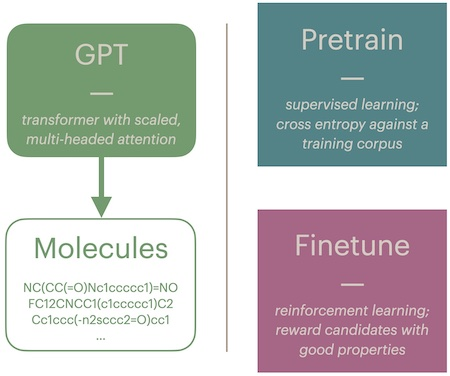

# ppo_mol

De novo molecule generation with a GPT-style transformer and Proximal Policy Optimization (PPO). I originally wrote this as a research intern at Eli Lilly & Co. All code is my own, and this repository contains nothing proprietary -- and arguably, nothing of commercial value.

**status 31 Jan, 2024:** I'm in the process of rewriting this repository. Pretraining seems to work well, although the hyperparameters are not tuned. Finetuning will come next.

## Use Case
Drug development is a search through the (very large) molecular space for chemicals with useful properties. Very generally speaking, a drug should be 'active' against a certain biological target -- for example, GSK3B, which is associated with bipolar disorder. Chemists also want drugs with certain pharmacokinetic (PK) characteristics: absorption, distribution, metabolism, excretion, and a host of others. Finding the right molecule is hard.

Computational chemistry tries to make life easier for chemists by narrowing the search space and automating some of the process. In this project, we take some methods that have been quite successful in language modeling, and apply them to chemistry -- namely, pretrained large language models finetuned with reinforcement learning. If it works, a chemist could **query the model to produce drug candidates with specific desirable properties.**

## Project Components
### pretraining
By representing molecules as strings via [SMILES](https://en.wikipedia.org/wiki/Simplified_molecular-input_line-entry_system), we can generate them with natural language processing (NLP) methods. In this case, we pretrain a GPT-style (decoder only) transformer on a corpus of 'good' molecules (for example, [ChEMBL](https://en.wikipedia.org/wiki/ChEMBL)). After pretraining, the transformer will generate molecules that resemble the training data.

### finetuning
By this point, the transformer should generate chemically 'valid' molecules, which satisfy basic constraints like valences. The user can query the transformer and produce a batch of molecules which will look similar to the training data; if you pretrained the transformer on a drug dataset, it will produce molecules that look like drugs.  However, our user wants to identify specific molecules from that larger space. To do that, we use reinforcement learning (RL).

RL methods like PPO assign a 'reward' to each generated molecule, then use backpropagation to modify the network to produce 'better' molecules. The reward, in our case, comes from an 'oracle' -- a black-box function trained to predict characteristics of molecules from their structure.

For example, we might want to generate molecules with a certain lipophilicity. We can use an oracle to calculate the [LogP](https://en.wikipedia.org/wiki/Partition_coefficient) of molecules we have generated, then use that feedback as a reward in PPO or some other RL algorithm. After many rounds of feedback, our model should learn to generate molecules that attain a high reward.

There are many caveats to this process -- see the **Limitations** section below.

## Example

*default write up and results still to come*

## Instructions
1. Install dependencies with `pip install -r requirements.txt`.
2. To pretrain a default model on default data, `python train.py cfg/pretrain.yaml`. You can modify this config file to adjust hyperparameters and dataset.
3. *finetuning not yet implemented*

## limitations
This is a very simple demonstration model with some important constraints.
### data
The included data is an academic standard provided by [BenevolentAI](https://github.com/BenevolentAI/guacamol), but this conceals the meta problem of data selection and preprocessing. The training dataset is several orders of magnitude smaller than what is needed for a real application. The choice of training data defines the model's distribution and might be considered a ceiling on what the model can provide. Moreover, the mapping of a molecule to its representation in SMILES is not 1:1. A user creating a new dataset would need to make several interesting choices: for example, how to handle chirality and aromaticity.

### targets
This system optimizes molecules for extremely simple targets that are readily calculable by open source models. An actual drug development pipeline would use much more complicated targets, such as a drug's absorption, distribution, metabolism, excretion, and toxicity (ADMET) properties. Moreover, the drug needs to *work* -- that is, it must be 'active' against its biological target. This activity might be estimated by complicated, costly molecular docking (MD) models and verified by even more expensive lab assays. The cost of obtaining this real world feedback might make current RL methods too inefficient or slow to be useful.

### problem formulation
Finally, this project phrases drug development as a de novo process, but this is not always or often the case. Chemists might want to use an existing molecular 'scaffold' with known, helpful properties and add bits to it to target a certain site ('scaffold hopping'); on the other hand, they might have an R group (branch) that needs a new scaffold ('R group search'). Both of these cases would need some head-scratching to use the SMILES/GPT/PPO method described in this project.

## References
* [guacamol](https://github.com/BenevolentAI/guacamol) (2018) -- an academic benchmark for molecular optimization. [paper](https://arxiv.org/abs/1811.09621)
* [nanoGPT](https://github.com/karpathy/nanoGPT) -- Andrej Karpathy's excellent, tiny transformer. Most of my transfomer code is a rewrite of his.
* [OpenAI's Spinning Up - PPO](https://spinningup.openai.com/en/latest/algorithms/ppo.html) -- OpenAI's discussion of PPO, with a reference implementation at [https://github.com/openai/spinningup/blob/master/spinup/algos/pytorch/ppo/ppo.py](https://github.com/openai/spinningup/blob/master/spinup/algos/pytorch/ppo/ppo.py).
* [Proximal Policy Optimization Algorithms](https://arxiv.org/abs/1707.06347) (2017) -- the original PPO paper.
---
## Disclaimer, Attributions
This is a completely new draft of some work I did as an intern at Eli Lilly & co. in 2023. It contains no proprietary information or trade secrets. I used Github Copilot to rewrite this project. The transformer architecture and training scripts owe a great debt to Andrej Karpathy's nanoGPT (see "References", above.)
